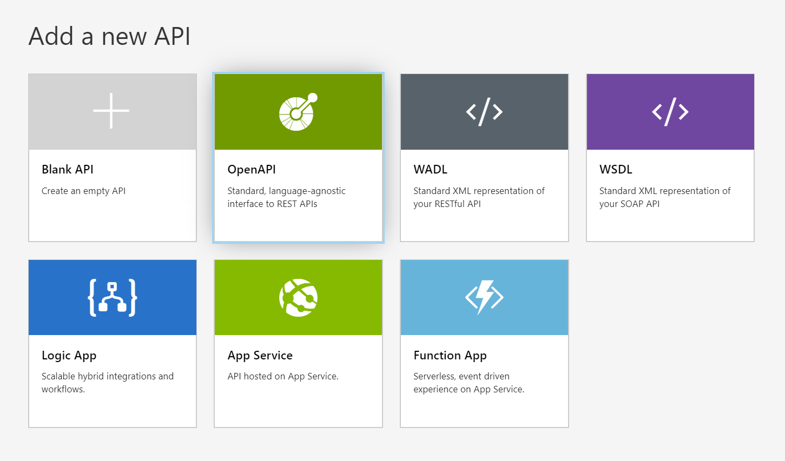
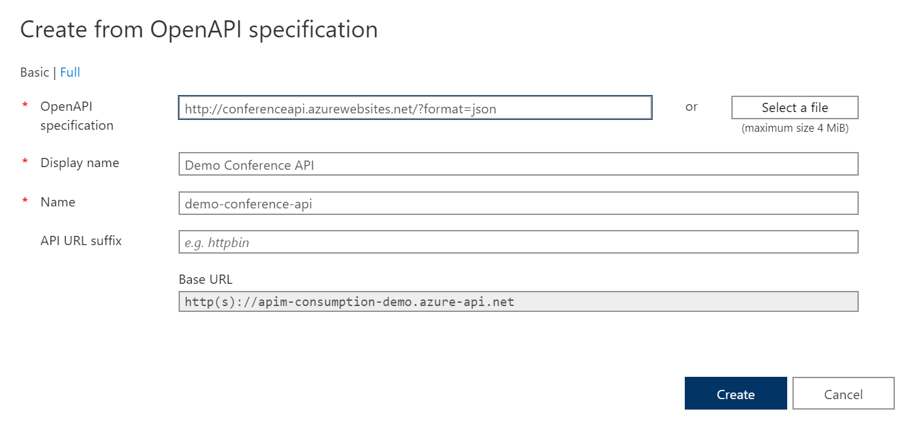
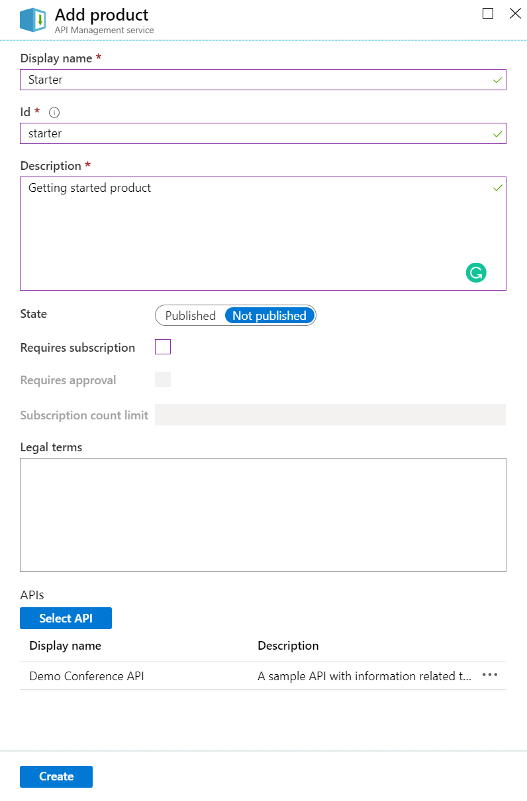

# Demo2 - Setting up your API

## Importing your API

1. From the left navigation pane, in the **API Management** section click on the **APIs** menu link.

1. You will now be presented with the **Add a new API** screen. Click on the **OpenAPI** option.

    

1. In the OpenAPI specification edit box, paste in the following URL `http://conferenceapi.azurewebsites.net/?format=json` and then the rest of the text boxes will automatically fill in. This URL is a demo API created by Microsoft.

1. Then click on the **Create** button.  

1. You should then see your new API added with all the available endpoints.

## Creating a Product

Now that your API is imported it's a good idea to associate it to a **Product**. Products let you group one or more APIs, define terms of use and set runtime policies. Consumers of your API can then subscribe to a product on the developer portal where they can obtain a key for calling your APIs.

1. Navigate to the **Products** menu item and click on the **Add** menu item.

1. Give your product a name and description. Optionally you can configure whether you require a subscription and if it requires approval, and then the legal terms if applicable.

1. Now click on the **Select API** button to choose the API you imported, then click on the **Select** button.

1. Finally click on the **Create** button to create your product.

In our next demo we'll walk through how you can test your API and create new endpoints with mocked results.

### Notes

- The Azure portal is not the most efficient tool for importing and configuring large numbers of APIs. As you scale up your API management, you'll need other tools. **Azure PowerShell** is one tool that allows you to manage your API gateway, and to import APIs. 

- There are cmdlets for deploying API gateways, defining and configuring products, importing APIs, and managing users and subscriptions.

## Resources

https://docs.microsoft.com/en-us/azure/api-management/import-and-publish

https://docs.microsoft.com/en-us/azure/api-management/api-management-howto-add-products