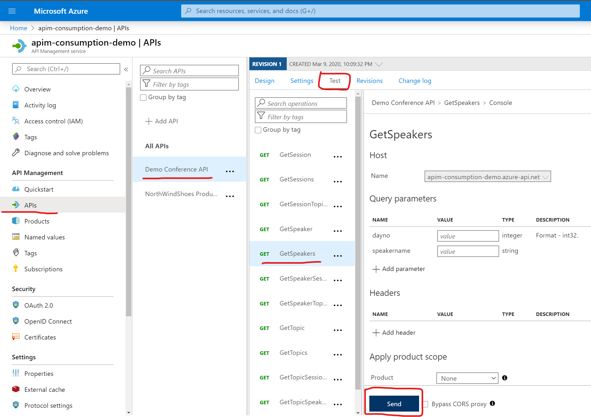
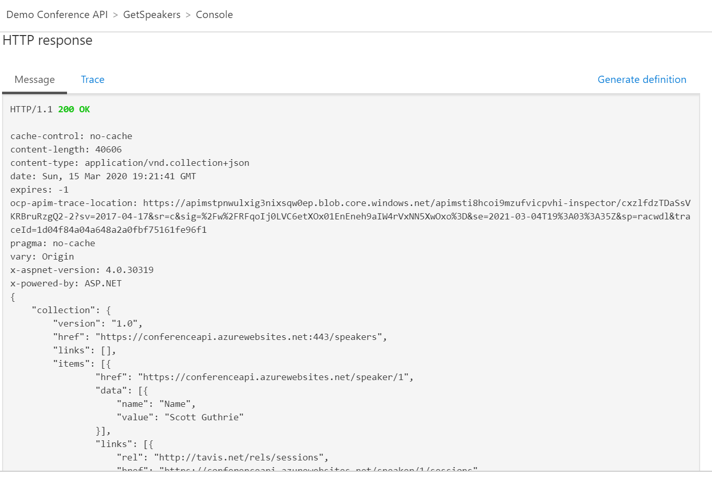
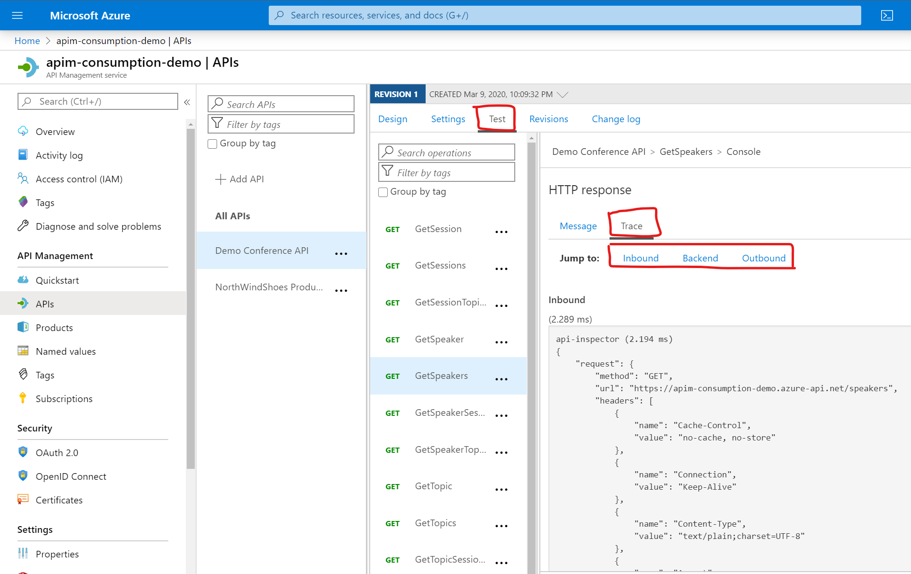
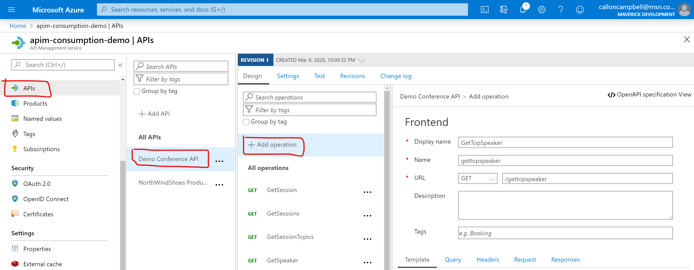
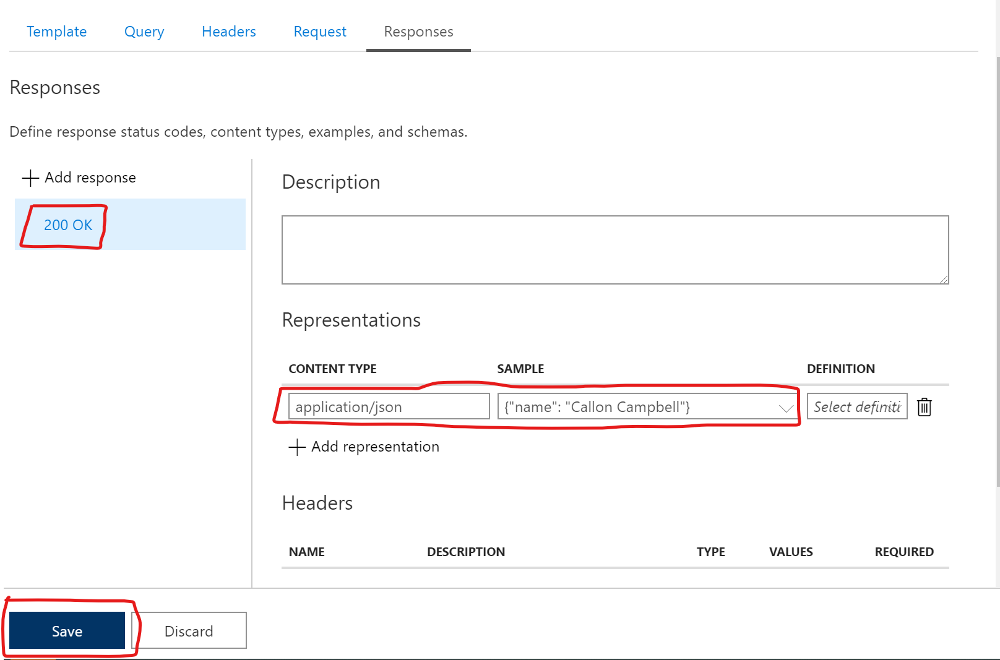
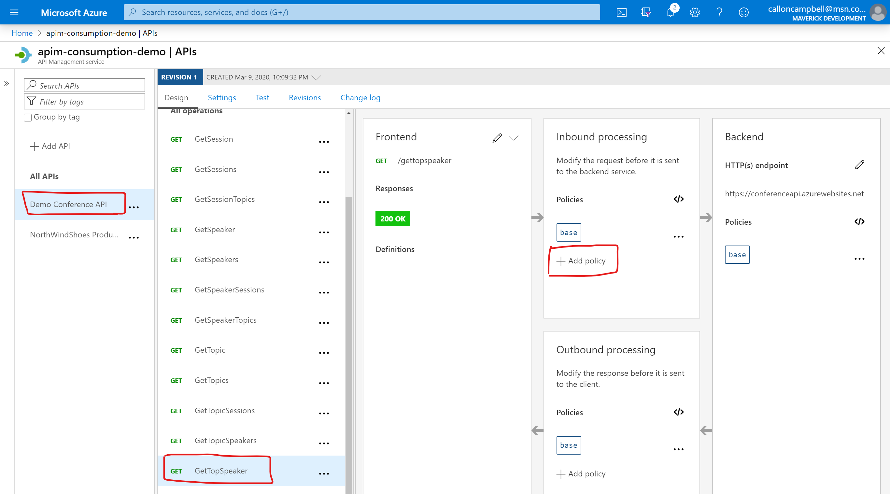
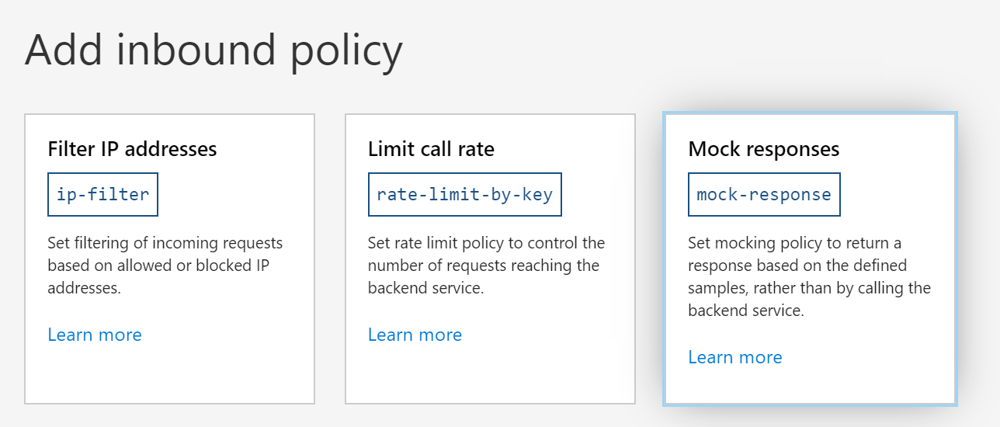
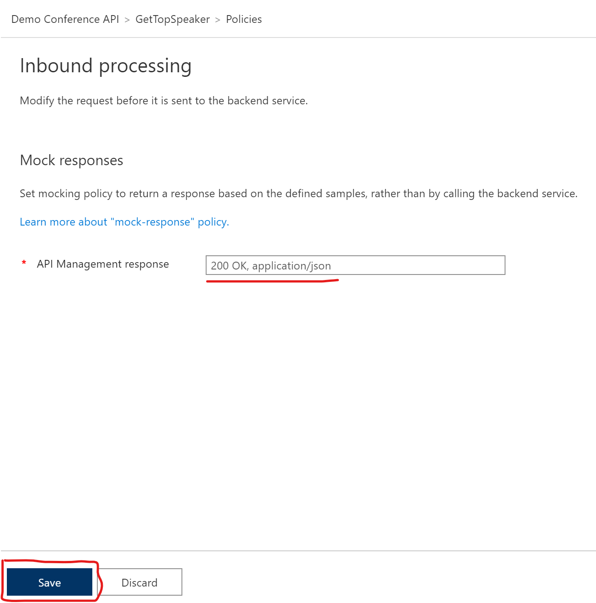
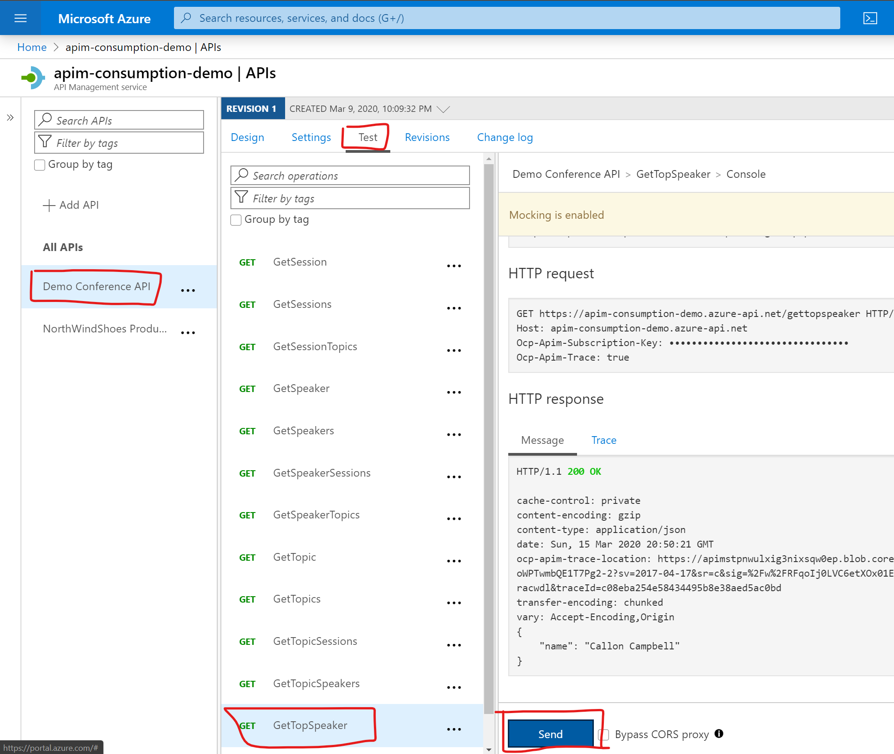

# Demo3 - Testing and Mocking your API

## Testing your API

Now that your API is imported to API Management, let's test it out to make sure everything is working as expect.

1. From the API Management navigation menu select **APIs**.
2. Click on your API, in this case **Demo Conference API**.
3. Switch to the **Test** tab.
4. Select the **GetSpeakers** operation.
5. Click **Send** to make the API call.

You should then see the message from your API operation in the HTTP response section.

If you switch to the **Trace** tab, you can then trace your **Inbound**, **Backend**, and **Outbound** events.

- The **Inbound** section will show you the original request API Management received from the caller and all the policies applied to the request.

- The **Backend** section will show you the requests API Management sent to the API backend and the response it received.

- The **Outbound** section will show you all the policies applied to the response before sending back to the caller.

## Mocking your API

### Add new operation to mock

So far we've walked through how to import an existing API but what happens if you dont have an API or you do and it's not ready for taking requests? 

API Management provides the ability to manually create your operations and even mock responses. The advatage of this is that it allows you to unblock your front end team so that you can implement and test your APIM instance even if the backend is not ready to accept requests. The ability to mock up your API responses can be useful for a number of scenarios:
- When the API facade is designed first and the backend comes later, or the backend is developed in parallel.
- When the backend is temporarily not available.

Let's create a new operation and then add a mocked response.

1. Go to the **APIs** menu in the API Management menu.
2. In the **Design** tab click on the **Add operation** link and fill in the following details:

    | Setting | Value | Description |
    | ------- | ----- | ----------- |
    Display name | `GetTopSpeaker` | What is displayed in the Developer Portal.
    Name | `gettopspeaker` | The unique name for this operation.
    URL |`GET` for http verb, and `/gettopspeaker` | The URL path for the API operation.

    

3. Now click on the **Responses** tab.
4. Click on the **Add response** link.
5. Select **200 OK** from the list.
6. Under the **Representations** section, click on **Add representation**.
7. For Content Type enter `application/json` and provide a sample of `{ "name": "Callon Campbell" }`.
8. Click on **Save**.

    

### Enable response mocking

Now that we have the new operation defined, let's create assign a mocked response to it.

1. Select the new operation you added.
2. In the window on the right, select the **Design** tab.
3. In the **Inbound processing** section, click on **Add policy**.

    

4. In the policy galery, select the **Mock responses** tile.

    

5. For the **API Management response** type `200 OK, application/json` if it's not already entered.
6. Click on **Save**.

    

### Testing your mocked operation

Now let's test our new mocked operation.

1. Select the new operation your created.
2. Click on the **Test** tab.
3. Click on the **Send** button.
4. The **HTTP response** section should now show you a 200 OK with your mocked response.

    

## Resources

https://docs.microsoft.com/en-us/azure/api-management/api-management-howto-api-inspector

https://docs.microsoft.com/en-us/azure/api-management/mock-api-responses