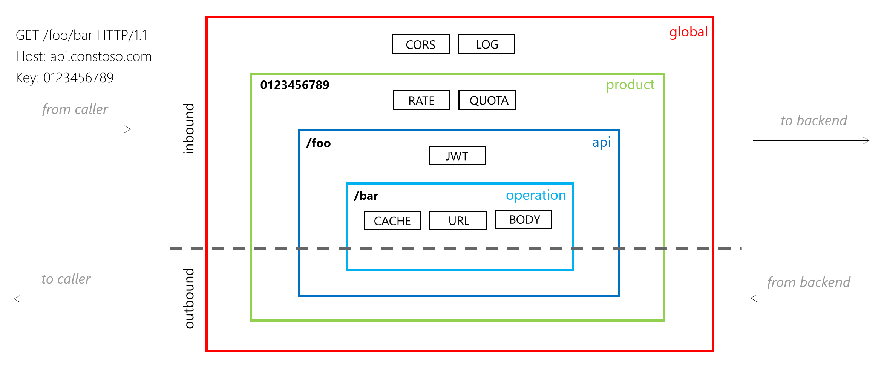
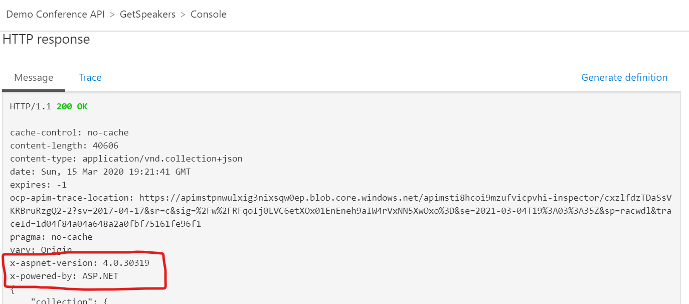
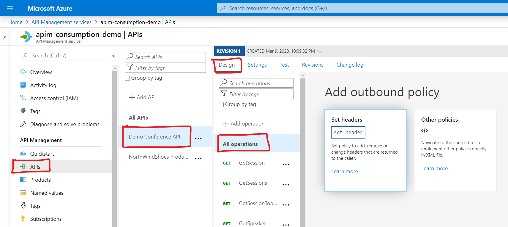
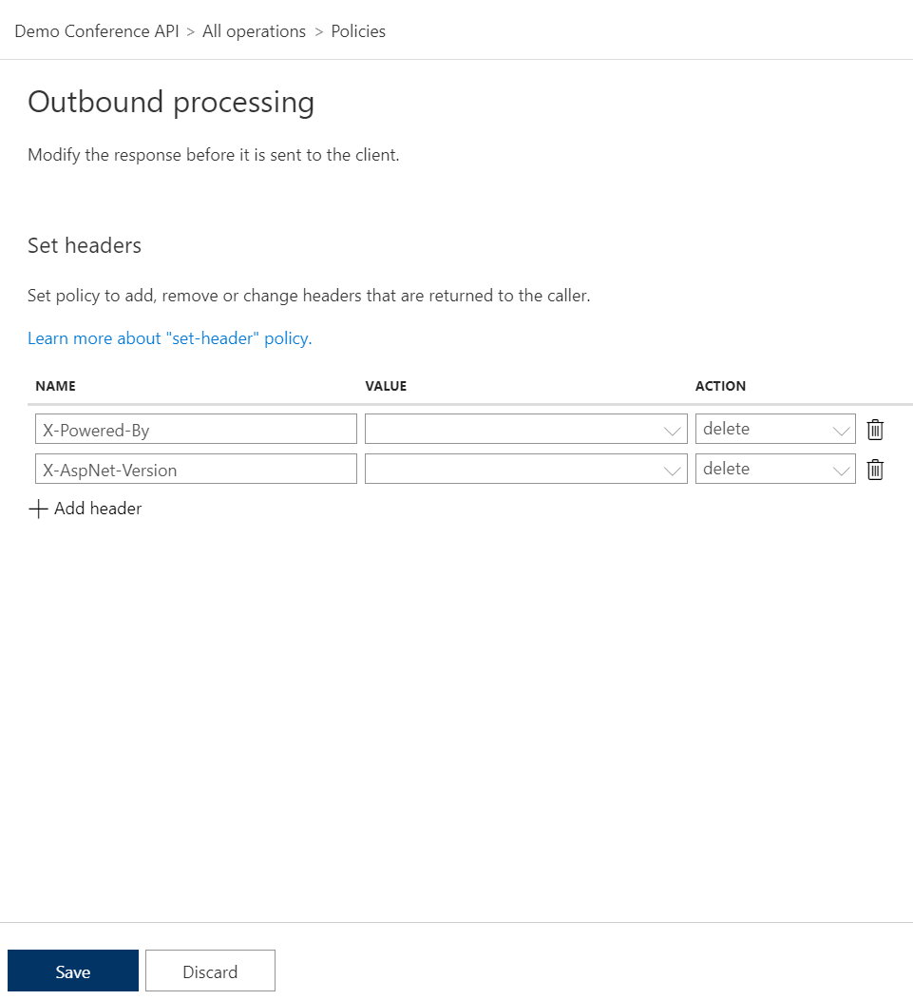
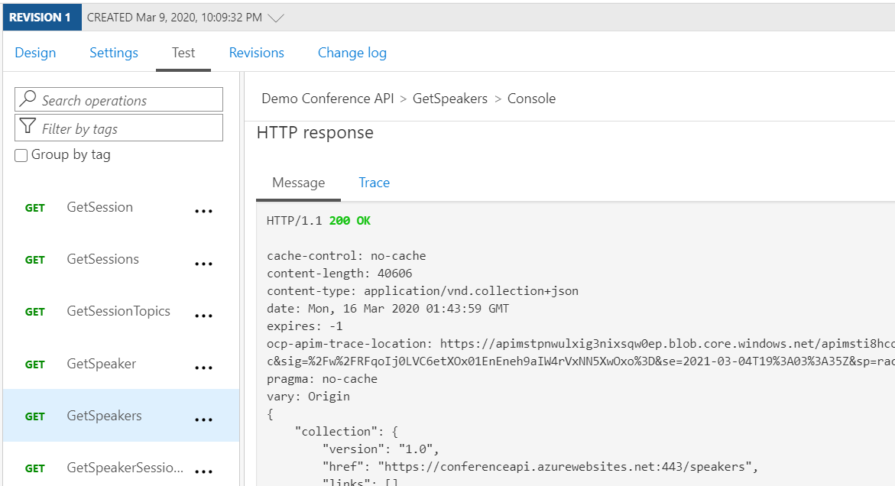
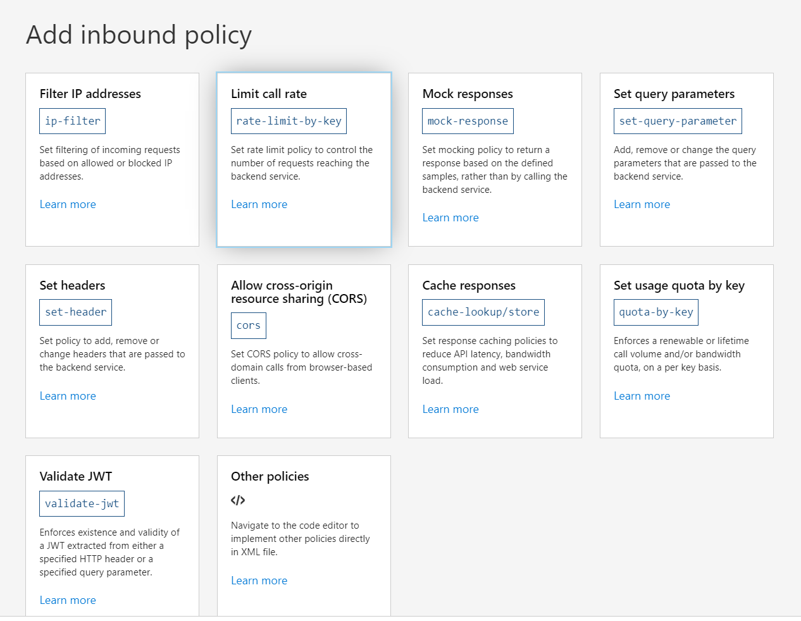
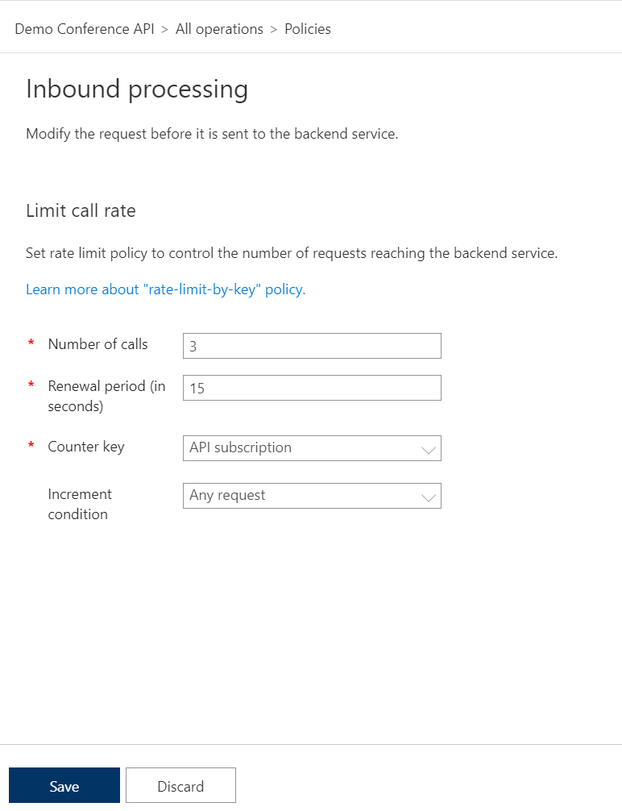
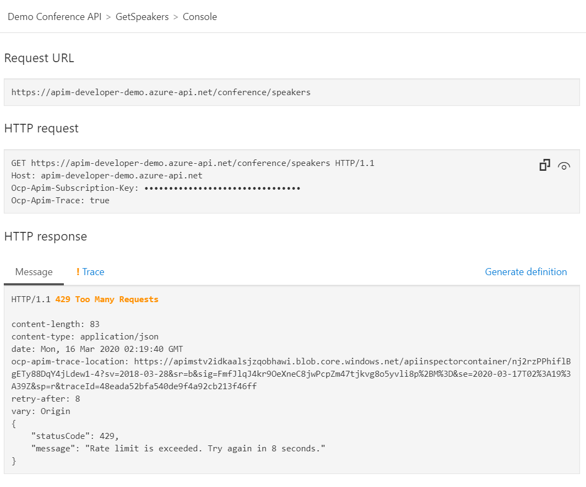

# Demo4 - Using policies to protect your API

As I mentioned in my presentation, policies in API Management are a powerful capability which allows you to change the behaviour of the API through configuration.
Policies can be scoped at many points as illustrated here.

The following are two policies which I demonstrated and are very easy to implement. For a complete index of policies currently supported checkout the docs on [API Management Policies](https://docs.microsoft.com/en-us/azure/api-management/api-management-policies).

## Transform an API to strip response headers

In this part of the demo I will show you how to remove certain HTTP headers that you don't want to expose to your users.

If you look at the response from demo 3, you will see the following headers.

Let's walk through how you can remove them.

1. Start by clicking on the **APIs** section in the API Management navigation menu.
2. Then select the API we added which was **Demo Conference API**.
3. Now select **All operations**.
4. From the **Outbound processing** section click on the **Add policy** link.
5. In the **Add outbound policy** gallery, select the **Set headers** tile.

    

6. Click on the **Add header** link to add the following headers:
 
    - Name `X-Powered-By` with Action of `delete`.
    - Name `X-AspNet-Version` with Action of `delete`. 

    

7. Then click on the **Save** button.

### Testing your transformation

Now go and test your API and you should see that these headers are no longer included in the response.

As you can see we removed the headers from the respose coming API Management.

## Protect your API with throttling and quotas

Another important aspect of API Management is to be able to throttle and set quotas on your API products.

1. Start by clicking on the **APIs** section in the API Management navigation menu.
2. Then select the API we added which was **Demo Conference API**.
3. Now select **All operations**.
4. From the **Inbound processing** section click on the **Add policy** link.
5. In the **Add inbound policy** galery, select the **Limit call rate** tile.

    

6. Set the **Number of calls** to `3`.
7. Set the **Renewal period** to `15`.
8. Set the **Counter key** to `API subscription`.

    

9. Then click on the **Save** button.

> [!NOTE]
> 
> The **Consumption** tier doesn't support the **rate-limit-by-key** policy and will throw the following error if you try to add it: `Error in element 'rate-limit-by-key' on line 16, column 10: Policy is not allowed in this sku 'Consumption'`. 
> For the purpose of this demo I created another APIM instance under the **Developer** tier.

### Testing your throttling

Now go and test your API. If you call it too many times to trigger the policy you will get a HTTP status code of 429 - Too many requests. 

The response will provide you with a `retry-after` header to tell you when you can call the API again.

## Resources

https://docs.microsoft.com/en-us/azure/api-management/api-management-policies

https://docs.microsoft.com/en-us/azure/api-management/transform-api